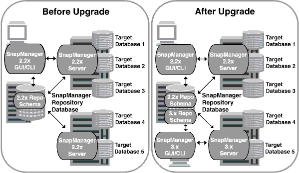

= 使用循環升級來升級SnapManager 功能
:allow-uri-read: 
:icons: font
:imagesdir: ../media/

[role="lead"]
支援循環升級方法、讓您以交錯、主機對主機的方式升級主機、SnapManager 可從版次3.1獲得支援。

僅有支援使用者可同時升級所有主機的版本。SnapManager這導致所有SnapManager 的故障主機停機、以及在升級作業期間排定的作業。

循環升級提供下列優點：

* 由於一次只升級一部主機、SnapManager 因此提升了VMware的支援效能。
* 在SnapManager 升級其他主機之前、能夠測試一部支援伺服器主機的新功能。

NOTE: 您只能使用命令列介面（CLI）執行循環升級。

在成功完成循環升級之後、SnapManager 與目標資料庫設定檔相關的複本、會從先前SnapManager 版本的儲存庫資料庫移轉至新版本的儲存庫資料庫。現在SnapManager 新版本的儲存庫資料庫中已提供使用先前版本所建立的設定檔、排程、備份和複製所執行作業的詳細資料。您可以使用user.config檔案的預設組態值來啟動GUI。不SnapManager 考慮在舊版的更新版本的user.config檔案中設定的值。

升級SnapManager 後的功能更新後、即可與升級後的儲存庫資料庫進行通訊。未升級的主機可使用舊版SnapManager 的更新儲存庫來管理目標資料庫、因此可以使用舊版的可用功能。

NOTE: 在執行循環升級之前、您必須先確定儲存庫資料庫下的所有主機都可以解析。如需如何解決主機問題的相關資訊、請參閱SnapManager 《適用於UNIX的SAP系統管理指南》中的疑難排解一節。

*相關資訊*

https://library.netapp.com/ecm/ecm_download_file/ECMP12481453["適用於UNIX的SAP系統管理指南SnapManager"^]
