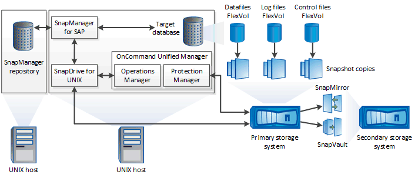

= 架構SnapManager
:allow-uri-read: 
:icons: font
:imagesdir: ../media/

[role="lead"]
適用於SAP的元件可搭配運作、為Oracle資料庫提供全方位且強大的備份、還原、還原及複製解決方案。SnapManager

== 適用於UNIX SnapDrive

需使用此解決方案才能與儲存系統建立連線。SnapManager SnapDrive在安裝支援前、您必須在SnapDrive 每個目標資料庫主機上安裝支援UNIX的功能。SnapManager

== SAP適用的SnapManager

您必須在SnapManager 每個目標資料庫主機上安裝適用於SAP的功能。

您可以使用安裝SnapManager 了SAP的資料庫主機上的命令列介面（CLI）或UI。您也可以SnapManager 從SnapManager 執行於支援的作業系統上的任何系統、使用網頁瀏覽器、從遠端使用此功能。

NOTE: 支援的JRE版本為1.8。

== 目標資料庫

目標資料庫是您想要透過SnapManager 執行備份、還原、還原及複製作業來管理的Oracle資料庫。

目標資料庫可以是獨立的Real Application叢集（RAC）、也可以位於Oracle自動儲存管理（ASM）磁碟區。如需支援的Oracle資料庫版本、組態、作業系統及傳輸協定的詳細資訊、請參閱NetApp互通性對照表工具。

== 系統儲存庫SnapManager

此解決方案儲存庫位於Oracle資料庫中、儲存有關設定檔、備份、還原、還原及複製的中繼資料。SnapManager單一儲存庫可包含在多個資料庫設定檔上執行的作業相關資訊。

無法將此資訊儲存庫存放在目標資料庫中。SnapManager執行還原作業之前、必須先在線上使用此系統資訊庫資料庫和目標資料庫。SnapManager SnapManager

== 統一化管理程式核心套件OnCommand

NetApp Unified Manager核心套件整合了Operations Manager、Protection Manager和Provisioning Manager的功能。OnCommand它能集中化資源配置、複製、備份與還原、以及災難恢復（DR）原則。整合所有這些功能、讓您能夠從單一工具執行許多管理功能。

== 營運經理

Operations Manager是OnCommand 以網路為基礎的使用者介面（UI）、包含在功能上。它用於日常儲存監控、發出警示、以及報告儲存與儲存系統基礎架構。整合功能運用Operations Manager的RBAC功能。SnapManager

== Protection Manager

Protection Manager提供系統管理員易於使用的管理主控台、可快速設定及控制所有SnapMirror和SnapVault SnapMirror作業。此應用程式可讓系統管理員套用一致的資料保護原則、自動化複雜的資料保護程序、以及集區備份與複寫資源、以提高使用率。

Protection Manager的介面是NetApp管理主控台、這是適用於NetApp管理軟體應用程式的用戶端平台。NetApp管理主控台可在Windows或Linux系統上執行、此系統與OnCommand 安裝此伺服器的伺服器不同。它可讓儲存設備、應用程式和伺服器管理員執行日常工作、而無需在不同的UI之間切換。在NetApp管理主控台中執行的應用程式包括Protection Manager、Provisioning Manager和Performance Advisor。

== 主儲存系統

可在主要NetApp儲存系統上備份目標資料庫。SnapManager

== 二線儲存系統

當您在資料庫設定檔上啟用資料保護時、SnapManager 由SnapMirror在主要儲存系統上建立的備份、會使用SnapVault SnapMirror和SnapMirror技術複寫到次要NetApp儲存系統。

*相關資訊*

http://mysupport.netapp.com/matrix["NetApp 互通性對照表工具"^]
